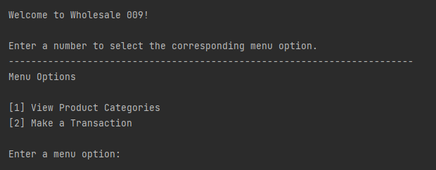
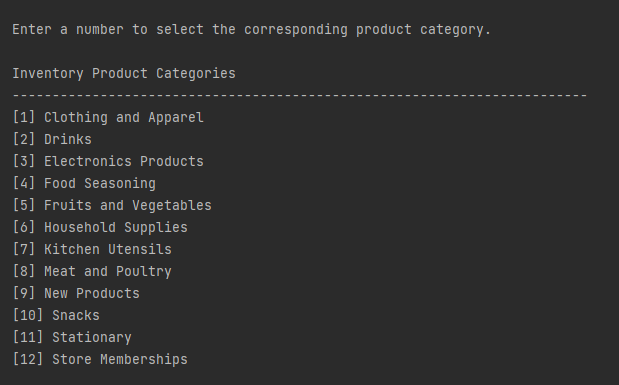
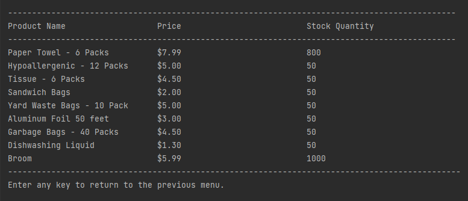

# Phase 2 Design Document

## Updated Specification
  
**Wholesale Inventory Management System**  
  
An inventory management system for a wholesale business similar to Costco. The inventory system can be accessed by two types of users (administrators and customers) using login credentials (username and password). The inventory system has an inventory that contains all of the store products. There is a name, price, and stock quantity associated with each product in the inventory.  
  
Customers and administrators can each make transactions. Each customer is able to add products to a personal shopping cart. Customers can add a desired quantity of a particular product if that product is available and if there is a sufficient quantity of that product in stock. Administrators are able to add new products to the inventory, modify prices of products, and modify product stock quantities.  **Store products are organized by categories (i.e. fruits and vegetables, household products, etc. ) and can be viewed by the user before making a transaction.** 

**Store memberships are available in three tiers (Silver, Gold, and Platinum) which provide store discounts to customers after a purchase**. Memberships will have an associated mobile number, payment method, and shipping address.

**Note:** Changes to the specification from Phase 1 is in bold above. 

## Additional Functionality added since Phase 2

We added a database class that can read and write data from JSON files which contain products that will be injected into our inventory. Products are organized by product categories (i.e. fruits and vegetables, household products, etc.).  

In phase 2 we expanded on our UI and added a Main Menu, where users can first browse through our product categories, and then choose to make a trandaction. Product categories are viewable for customers and administrators in a table in our command line user interface through our `ProductList`  and `ProductCategoryUI` classes. Customers and administrators can select a category and view its corresponding products (containing name, price and stock information) prior to making a transaction. 

Our program now has additional **data persistence** and **serialization**. Whenever an administrator adds a product to the inventory, the product is also added to the database in `New_Products.json`. Similarly, whenever an administrator modifies the price or stock quantity of an existing product in the inventory, the database `.json` files are updated accordingly. When a customer successfully adds a product of a specified quantity to their shopping cart, the stock quantity of that product within the database is updated accordingly. We have added a login system which serializes a user's username and password and stores them in a `.ser` file. Returning users are greeted when logging back into the program. 

In phase 2 we implemented store memberships for customers. After a customer adds a product of a specified quantity to their shopping cart, they are asked to purchase a membership (Silver/Gold/Platinum) which provides various store discounts. We used the Template Design Pattern to create various memberships, each providing a different store discount.

### The Main Menu

### The Product Category Menu

### Example of Product View

## Additional Changes since Phase 2 Presentation

We added the interfaces `InventorySystemBoundary`, `UserManagerBoundary` and `ServiceInjector` so that more classes
do not depend on each other directly. So our classes are now more loosely coupled and adhere more closely to Clean Architecture. 

## How to Use the Program

When presented with the main menu, enter 1 if you wish to see a list of product categories and follow the instructions to view the products contained in a particular category. 

If instead you wish to make a transaction, enter 2. Enter either 'customer' or 'administrator' to continue. 

If 'customer' is chosen, enter a username and password. Then enter a product name and desired quantity. If the product is available and in stock, the desired quantity of product will be successfully added to cart. If the product is unavailable, or there is insufficient stock, the product is not added to cart. Finally, select a store membership to purchase. A transaction summary will then be provided.

If 'administrator' is chosen, enter a username and password. Then enter a product name, price, and stock quantity. If the product is a new product, then the product will be added to the inventory and will be added
to the database in `New_Products.json`. If the product already exists in the inventory and database, then the user inputted price and stock quantity of that product will be updated in the database in the corresponding `.json` file. 
A transaction summary will then be provided. 

## UML Class Diagram

A UML class diagram is provided within the `phase2` folder in `UML_diagram.pdf` and `UML_diagram.uml` formats. 

## Major Design Decisions

1. We decided to continue with a command line user interface for Phase 2. We already have a `PromptIterator` class that can iterate through command prompts which is useful in a command-line interface. We also did this so we can focus our project more on implementing design patterns,  adhering to Clean Architecture and SOLID principles, and adding additional functionality. 

2. We decided to expand on our UI by adding a main menu where users can view products contained in the store inventory prior to making a transaction. In phase 1, users had to view products in the .JSON files in our database. Now, products are displayed in our command line UI. 

3. We decided to add a login system where users can login/signup using login credentials. These login credentials are saved and serialized in a `.ser` file. So we have additional data persistence.

## How our Project adheres to Clean Architecture

Our dependencies now all point inwards. i.e. Classes in the outer layer all depend on classes within the same layer, or depend on classes in the next inner layer. Our classes are now well encapsulated. 

We created boundary interfaces between certain layers of clean architecture.  For instance, our `DatabaseAccess` class implements a `DatabaseAccessBoundary` interface. And our controller class `TransactionSystem` depends on the interface `DatabaseAccessBoundary`, as opposed to directly depending on the implementing class `DatabaseAccess`. So we use dependency inversion, as required. Our other boundary interfaces include `LoginInputBoundary`, `InventorySystemBoundary` and `UserManagerBoundary`. 

We packaged our code according to layers, and hence our import statements show that each class imports classes within the same layer of clean architecture, or the next inner layer. 

## How our Project adheres to SOLID principles

### Single Responsibility Principle

Our classes are each responsible for a single function of our program.  Initially, our `TransactionSystem` violated the Single Responsibility Principle and had many responsibilities (creating users, inventory management, etc.). But now responsibilities are separated and delegated to the classes `UserManagerBoundary`, `DatabaseAccessBoundary`, `InventorySystemBoundary`.  Now, `TransactionSystem` serves as a facade, in accordance with the Facade Design Pattern. 

### Open/Closed Principle

Our classes are well encapsulated and hence are open to extension, but closed to modification. We have a `TransactionFactory` interface with a `createTransaction` method. We currently have two transaction classes, `CustomerTransaction`, and `AdministratorTransaction` which implement the `TransactionFactory` interface. In the future, we could extend our program by adding a new transaction class that implements `TransactionFactory` without having to modify any existing code. 

We also implemented the Template method for our store memberships. We currently have 3 memberships (Silver, Gold, Platinum), but we can easily add more memberships without modifying existing code. 

We also have product categories in the form of `.json` files. Our `DatabaseAccess` class iterates through each file in the directory containing these `.json` files.  If we wanted to add a new product category, we simply need to add the `.json` file into the `database.data` directory. We do not need to add any additional code since `DatabaseAccess` iterates through this directory. And the new product category associated with this `.json` file will be viewable in our UI. 

### Liskov Substitution Principle

Our main use of inheritance in our program is in our `User` class, which has the `Customer` and `Administrator` classes as child classes.  Any usage of the `User` class is substitutable by a usage of the `Customer` and `Administrator` classes without causing any issues with the rest of our code. 

### Interface Segregation Principle

Each interface in our program is quite small, with only a few methods (approximately 1-10 each). And every class that implements an interface in our program always uses every method contained in the interface. No class depends on methods it does not use. There are no unused methods by any implementing classes, therefore adhereing to the interface segregation principle. 

### Dependency Inversion Principle

In Phase 2, we created boundary interfaces between some layers so that certain classes now depend on these boundary interfaces as opposed to directly depending on their implementing classes. For example, our `TransactionSystem` class is dependent on the `DatabaseAccessBoundary` interface, as opposed to the `DatabaseAccess` class which implements this interface. The dependency is inverted through this interface since our database is in our Frameworks and Driver layer, whereas our `TransactionSystem` is a controller in our Interface Adapters layer. So this dependency inversion was necessary.

## Design Patterns 

### Iterator Design Pattern

We used the Iterator Design Pattern for our `PromptIterator` class. It contains `hasNext()` and `next()` methods which allows us to iterate through command prompts which will later be provided to the user of our program. 

### Facade Design Pattern

We used the Facade Design Pattern for our controller class, `TransactionSystem` . The `TransactionSystem` class was initially responsible for multiple actors and had multiple responsibilities (creating users, inventory management, etc.). Now, with the Facade Design Pattern, we now consider `TransactionSystem` class as a Facade class, and delegate responsibilities to the following classes: `InventorySystemBoundary`, `UserManagerBoundary`, and `DatabaseAccessBoundary`.  The `InventorySystemBoundary` class creates an inventory, `DatabaseAccessBoundary` injects products into this inventory, and `UserManagerBoundary` creates and manages users. 

### Factory Design Pattern

We have a `TransactionFactory` interface which has a `createTransaction` method. We created `CustomerTransaction` and `AdministratorTransaction` which both implement the `TransactionFactory` interface. Each implementation creates a transaction for a customer and administrator respectively. Our `TransactionSystem` class then creates instances of `CustomerTransaction` and `AdministratorTransaction` and then calls the `createTransaction` method.  In the future, if we wanted to add a new type of transaction, we would simply create a new class that implements `TransactionFactory`.

### Singleton Design Pattern

We applied the Singleton Design Pattern to our `MenuUI` class to ensure that there was a single instance of `MenuUI` for our program. Within the `MenuUI` class, we made the constructor for `MenuUI` private and created a private static instance of `MenuUI`. We have a `getInstance()` method that returns the single instance of `MenuUI`. We then call the `getInstance()` method in our `WholesaleMain` class which contains our program's main method and serves as the entrypoint to our program. 

### Template Design Pattern

We implemented the Template Design Pattern to allow for various store memberships (Silver, Gold, Platinum) which provide customers with discounts. Memberships are related in terms of functionality, but will differ in the amount of discount provided. 

## Packaging Strategy

We packaged our classes according to layers of Clean Architecture. Our UI, Database, Controllers, Use Cases, and Entity classes are all in separate layers. 

We did this to simplify the number of import statements that we required. Within any class, import statements are only made to other classes within the same layer, or the first inner layer. 

We also chose this packaging strategy to allow us to easily catch any obvious violations of Clean Architecture. Our program has improved since Phases 0 and 1 in terms of adhering to Clean Architecture. 

## Use of GitHub features

We made sure to make a new branch for each new feature we wanted to add to our program. We made sure each commit had a brief message of what work was completed. And we made pull requests when we wanted to merge to the main branch of the repository. 

## Accessibility Report

The accessibility report is in a separate `accessibility.md` file in the `phase2` directory. 

## Phase 2 Progress Report

**Open Questions:**

1. Our program improved since Phase 1 in regard to adhering to Clean Architecture and Solid Principles. We refactored our code quite a bit and created boundary interfaces. Are there any obvious violations of clean architecture remaining in our code?

2. We used 5 design patterns explicitly in our program. Are there any additional design patterns that our program could have used?

**What has worked well with our design:**

1. Our main method in WholesaleMain is nice and short with only 2 lines of code in the body. So the entrypoint of our program is very concise.

2. Our `PromptIterator` class which implements the Iterator Design Pattern allow us to easily extend our program by adding new prompts through `.txt` files without having to do any hard coding.  We even use this `PromptIterator` to give users instructions in our command line user interface.

3. Our use of JSON files allow us to easily create new product categories for our inventory. And our `DatabaseAccess` class iterates through every `.json` file within the `database/data` directory. Hence, we can always create a new product category by creating  a `.json` file and simply drop it in the `database/data` directory without having to add any additional java code.

## What each group member has been working on since Phase 1

### Raguram Sivabalan

Added a few boundary interfaces between layers of our program. Implemented the Factory design pattern for the `TransactionSystem`. Implemented the Singleton design pattern for the `MenuUI`. Created the Main Menu for the command line user interface allowing users to view product categories and individual product information in a table. Added test classes and refactored code.

Github Link: https://github.com/CSC207-UofT/course-project-group-009/pull/30

This pull request was for creating the main menu of our program to allow users to view product categories in a table within the command line user interface.

### Yong Tong Zhu

Implemented the Template Design pattern for the store memberships. Added command-line prompts for the store memberships for customers. Added product categories to the database. Added test classes.

Github Link: https://github.com/CSC207-UofT/course-project-group-009/pull/29

This pull request was for implementing the Template design pattern and for creating the command prompts for store memberships for customers in the command line user interface.

### Yiyang Du

Worked on the login system of our program which uses serialization. Added product categories to the database.

Github Links: https://github.com/CSC207-UofT/course-project-group-009/commits/LoginSystem

and https://github.com/CSC207-UofT/course-project-group-009/commits?author=YiyangDu

Commits showing work on LoginSystem and Database JSON files. Some files were merged manually.

### Shijia Ye

Worked on the login system of our program which uses serialization. Added product categories to the database.

Github Link: https://github.com/CSC207-UofT/course-project-group-009/commits/LoginSystem

and https://github.com/CSC207-UofT/course-project-group-009/commits?author=bisbtmaFMP

Commits showing work on LoginSystem and Database JSON files. Some files were merged manually. 